# System Architecture

**Australian Privacy Act ADM Compliance Framework**

Version: 1.0.0
Last Updated: 2024-01-XX

---

## Table of Contents

- [Overview](#overview)
- [High-Level Architecture](#high-level-architecture)
- [Component Architecture](#component-architecture)
- [Data Flow Diagrams](#data-flow-diagrams)
- [Database Schema](#database-schema)
- [Security Architecture](#security-architecture)
- [Deployment Architecture](#deployment-architecture)
- [Integration Architecture](#integration-architecture)
- [Scalability & Performance](#scalability--performance)

---

## Overview

The Australian Privacy Act ADM Compliance Framework is a full-stack enterprise application designed to help organizations comply with Australian Privacy Act 1988 requirements for automated decision-making systems.

### Technology Stack

**Backend:**
- Python 3.11+
- FastAPI (async web framework)
- SQLAlchemy 2.0 (ORM)
- PostgreSQL 15 (database)
- Redis (caching, sessions)
- Celery (async tasks)

**Frontend:**
- React 18
- TypeScript
- Material-UI (MUI)
- React Router v6
- Axios

**Infrastructure:**
- Docker & Docker Compose
- Kubernetes (AKS)
- Terraform (IaC)
- Azure Cloud (Australia East/Southeast)

---

## High-Level Architecture

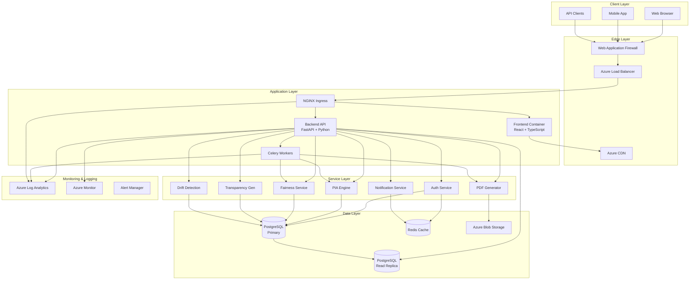

### Architecture Principles

1. **Separation of Concerns** - Clear boundaries between presentation, business logic, and data layers
2. **Microservices-Ready** - Service layer designed for future microservices extraction
3. **API-First** - RESTful API with OpenAPI documentation
4. **Stateless Backend** - Horizontal scaling with session data in Redis
5. **Event-Driven** - Async task processing with Celery
6. **Data Sovereignty** - All data stored in Australian Azure regions only
7. **Defense in Depth** - Multiple security layers (WAF, network policies, RBAC, encryption)
8. **Observability** - Comprehensive logging, metrics, and tracing

---

## Component Architecture

### Frontend Architecture

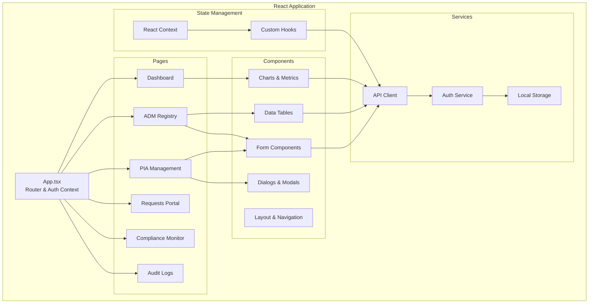

**Key Frontend Features:**
- **JWT Authentication** - Token-based auth with auto-refresh
- **Role-Based UI** - Components visible based on user role
- **Responsive Design** - Mobile-first Material-UI components
- **Real-Time Updates** - WebSocket connections for live metrics
- **Accessibility** - WCAG 2.1 Level AA compliance
- **Error Boundaries** - Graceful error handling

### Backend Architecture

```mermaid
graph TB
    subgraph "FastAPI Application"
        MAIN[main.py<br/>App Entry Point]

        subgraph "API Routes"
            AUTH_API[/api/auth]
            ADM_API[/api/adm-systems]
            PIA_API[/api/pias]
            FAIR_API[/api/fairness]
            REQ_API[/api/requests]
            COMP_API[/api/compliance]
            AUDIT_API[/api/audit]
            REPORT_API[/api/reports]
        end

        subgraph "Services"
            PIA_SVC[PIA Service]
            FAIR_SVC[Fairness Service]
            TRANS_SVC[Transparency Service]
            DRIFT_SVC[Drift Service]
            PDF_SVC[PDF Generator]
            EMAIL_SVC[Email Service]
        end

        subgraph "Data Access"
            MODELS[SQLAlchemy Models]
            SCHEMAS[Pydantic Schemas]
        end

        subgraph "Middleware"
            CORS[CORS Middleware]
            AUTH_MW[Auth Middleware]
            RATE[Rate Limiting]
            LOG_MW[Logging Middleware]
        end

        subgraph "Utilities"
            VALID[Validators]
            HELPERS[Helper Functions]
            EXCEPT[Exception Handlers]
            CONFIG[Configuration]
        end
    end

    MAIN --> CORS
    MAIN --> AUTH_MW
    MAIN --> RATE
    MAIN --> LOG_MW

    AUTH_API --> MODELS
    ADM_API --> MODELS
    PIA_API --> PIA_SVC
    FAIR_API --> FAIR_SVC
    REQ_API --> MODELS
    COMP_API --> TRANS_SVC
    AUDIT_API --> MODELS
    REPORT_API --> PDF_SVC

    PIA_SVC --> MODELS
    PIA_SVC --> DRIFT_SVC
    FAIR_SVC --> MODELS
    TRANS_SVC --> MODELS
    PDF_SVC --> EMAIL_SVC

    MODELS --> SCHEMAS

    PIA_SVC --> VALID
    FAIR_SVC --> HELPERS
    AUTH_API --> VALID
```

**Key Backend Features:**
- **Async Request Handling** - FastAPI async/await for high concurrency
- **Dependency Injection** - FastAPI dependencies for auth, DB sessions
- **Schema Validation** - Pydantic models for request/response validation
- **Exception Handling** - Custom exception classes with HTTP status codes
- **API Documentation** - Auto-generated OpenAPI/Swagger docs
- **Background Tasks** - Celery for async processing (PDF generation, emails)

---

## Data Flow Diagrams

### Privacy Impact Assessment (PIA) Flow

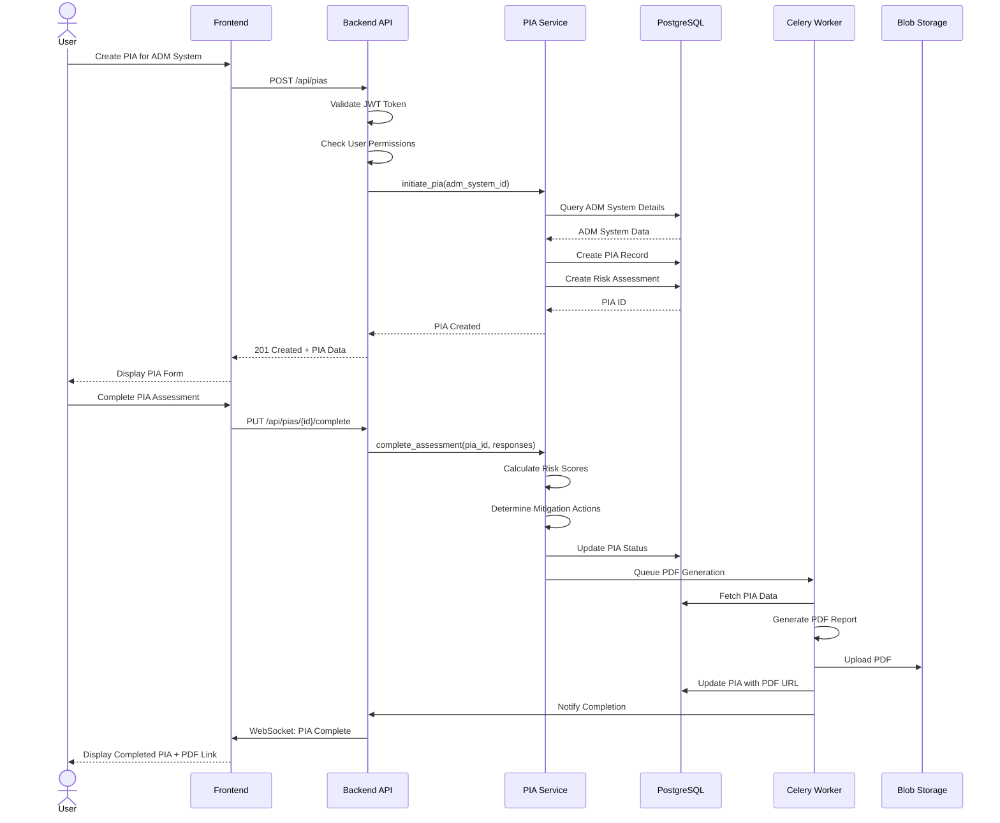

### Fairness Assessment Flow

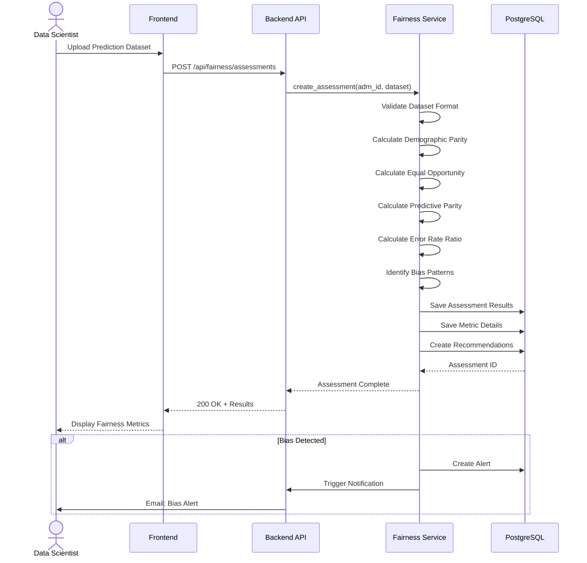

### Individual Rights Request Flow

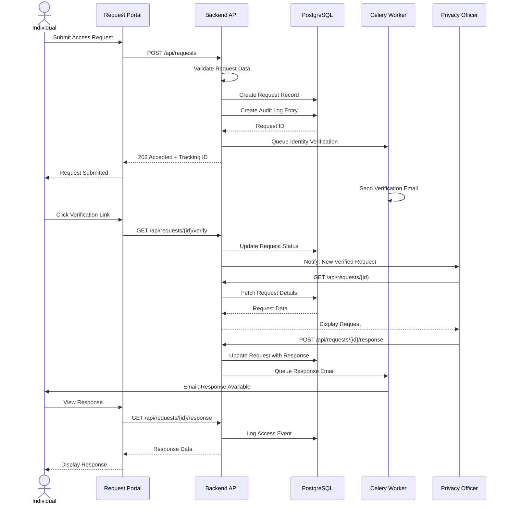

### Drift Detection Flow

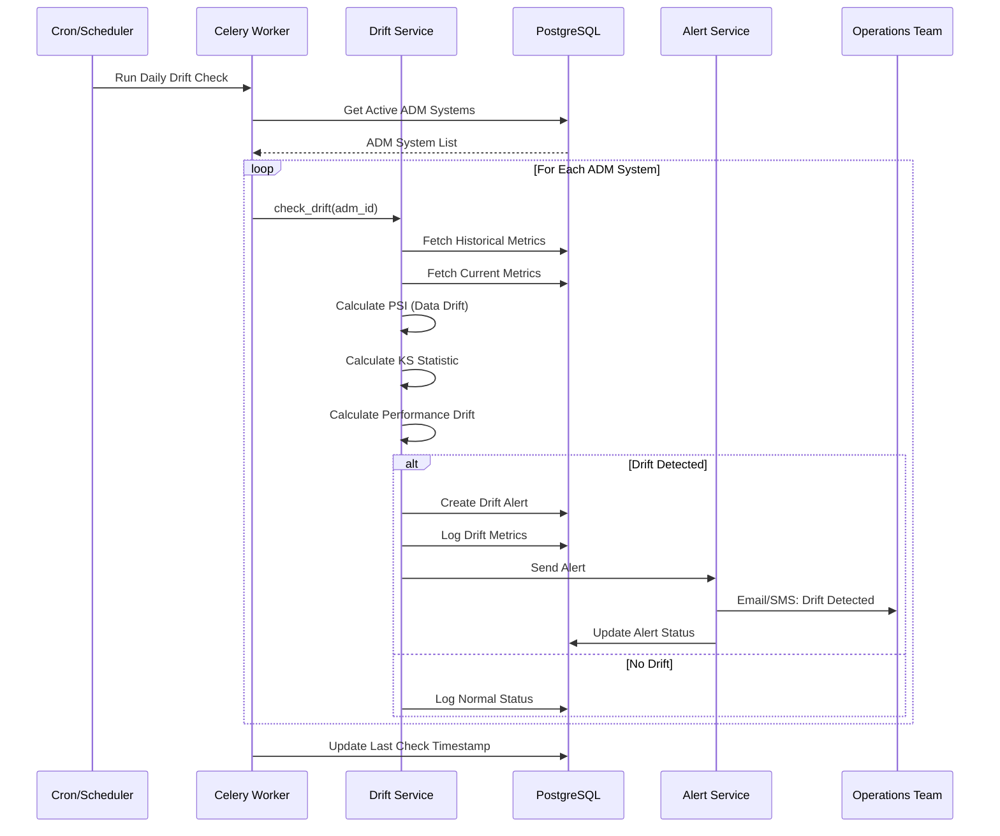

---

## Database Schema

### Entity Relationship Diagram

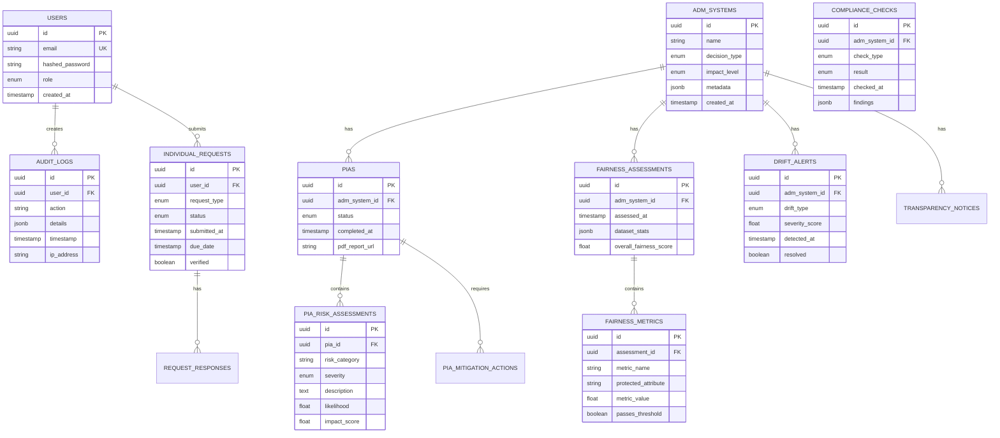

### Database Design Principles

1. **Normalization** - 3NF with strategic denormalization for performance
2. **UUID Primary Keys** - Globally unique, non-sequential IDs
3. **Immutable Audit Logs** - PostgreSQL rules prevent modification/deletion
4. **JSONB for Flexibility** - Structured yet flexible metadata storage
5. **Temporal Data** - Created/updated timestamps on all entities
6. **Referential Integrity** - Foreign keys with cascade rules
7. **Indexes** - Strategic indexes on frequently queried columns
8. **Partitioning** - Audit logs partitioned by month
9. **Full-Text Search** - GIN indexes for text search
10. **Materialized Views** - Pre-computed compliance dashboard metrics

---

## Security Architecture

### Security Layers

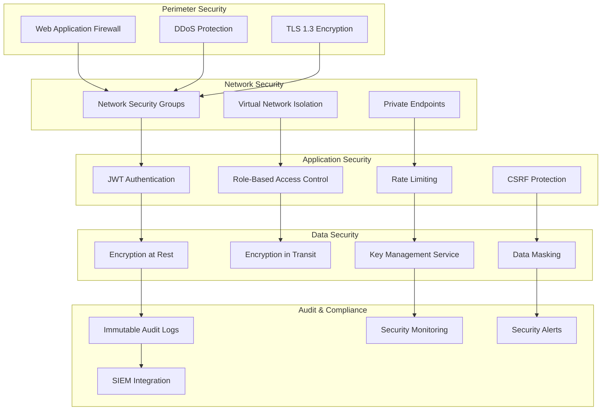

### Authentication Flow

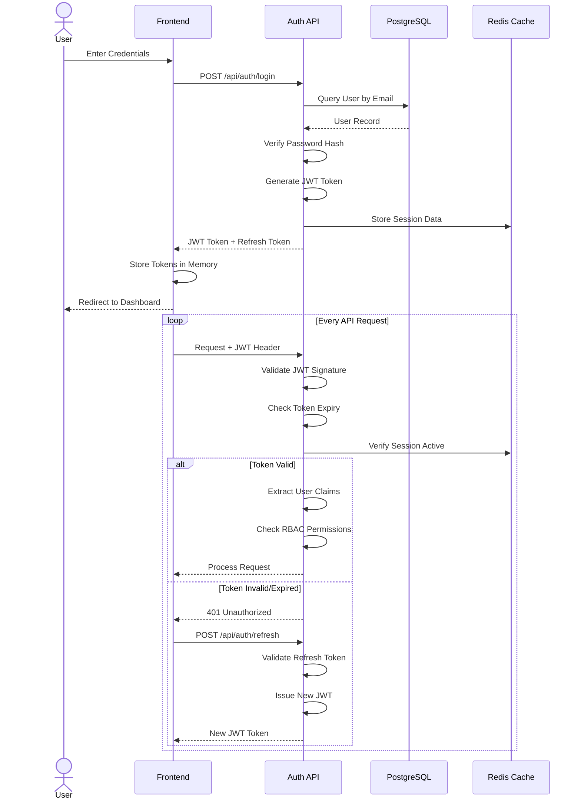

### Role-Based Access Control (RBAC)

| Role | Permissions |
|------|------------|
| **System Administrator** | Full system access, user management, configuration |
| **Privacy Officer** | PIA management, compliance oversight, reports |
| **Data Scientist** | Fairness assessments, drift monitoring, model metrics |
| **Auditor** | Read-only access to all data, audit logs, reports |
| **Business User** | View ADM systems, request transparency notices |
| **Individual** | Submit rights requests, view own data, track requests |

### Data Encryption

**Encryption at Rest:**
- PostgreSQL: Transparent Data Encryption (TDE)
- Azure Blob Storage: AES-256 encryption
- Secrets: Azure Key Vault with HSM backing

**Encryption in Transit:**
- TLS 1.3 for all HTTPS connections
- Certificate pinning in mobile apps
- Mutual TLS for service-to-service communication

---

## Deployment Architecture

### Azure Kubernetes Service (AKS) Deployment

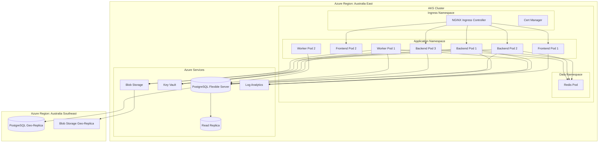

### Container Specifications

**Frontend Container:**
```yaml
Image: adm-compliance-frontend:1.0.0
Resources:
  CPU: 500m - 1000m
  Memory: 512Mi - 1Gi
Replicas: 2-10 (HPA)
Health Checks:
  Liveness: HTTP GET / (30s interval)
  Readiness: HTTP GET /health (10s interval)
```

**Backend Container:**
```yaml
Image: adm-compliance-backend:1.0.0
Resources:
  CPU: 1000m - 2000m
  Memory: 2Gi - 4Gi
Replicas: 3-20 (HPA based on CPU/Memory)
Health Checks:
  Liveness: HTTP GET /health (30s interval)
  Readiness: HTTP GET /health/ready (10s interval)
Environment:
  - DATABASE_URL (from Secret)
  - REDIS_URL (from Secret)
  - JWT_SECRET (from Key Vault)
```

**Worker Container:**
```yaml
Image: adm-compliance-worker:1.0.0
Resources:
  CPU: 2000m - 4000m
  Memory: 4Gi - 8Gi
Replicas: 2-10 (HPA based on queue depth)
Queue: Celery with Redis broker
Tasks:
  - PDF Generation (high priority)
  - Email Sending (medium priority)
  - Drift Detection (scheduled)
  - Report Generation (low priority)
```

---

## Integration Architecture

### External System Integrations

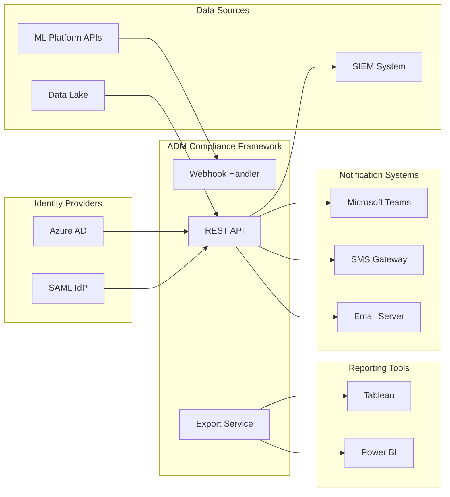

### API Integration Patterns

**Inbound Integrations:**
- RESTful API with OpenAPI 3.0 spec
- Webhook endpoints for event notifications
- Bulk data import via CSV/JSON upload
- SAML/OAuth2 for SSO authentication

**Outbound Integrations:**
- Webhook notifications for critical events
- Email/SMS notifications via configurable providers
- SIEM integration via syslog/CEF format
- Export API for BI tools (JSON, CSV, Parquet)

---

## Scalability & Performance

### Horizontal Scaling Strategy

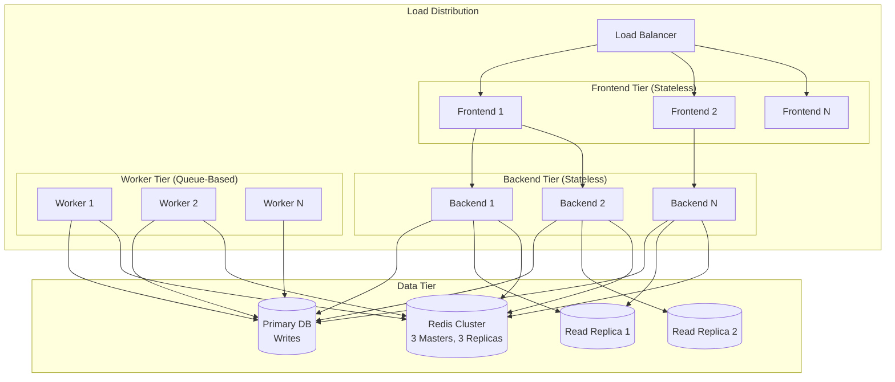

### Performance Targets

| Metric | Target | Measurement |
|--------|--------|-------------|
| **API Response Time** | < 200ms (p95) | All GET endpoints |
| **API Response Time** | < 500ms (p95) | POST/PUT endpoints |
| **Page Load Time** | < 2s | Frontend initial load |
| **Database Queries** | < 50ms (p95) | Simple queries |
| **Concurrent Users** | 10,000+ | Simultaneous active sessions |
| **Throughput** | 1,000 req/s | API requests per second |
| **Availability** | 99.9% | Annual uptime SLA |
| **PDF Generation** | < 30s | PIA report generation |
| **Fairness Assessment** | < 5min | 100k record dataset |

### Caching Strategy

**Redis Cache Layers:**
1. **Session Cache** - User sessions, JWT blacklist (TTL: 1 hour)
2. **Query Cache** - Frequently accessed data (TTL: 5 minutes)
3. **API Response Cache** - GET endpoint responses (TTL: 1 minute)
4. **Computed Metrics** - Dashboard statistics (TTL: 10 minutes)

**CDN Caching:**
- Static assets (JS, CSS, images): 1 year
- API responses (read-only): 1 minute
- HTML pages: No cache (dynamic)

### Database Optimization

**Read/Write Splitting:**
- All writes → Primary database
- Read queries → Round-robin across read replicas
- Dashboard queries → Materialized views

**Connection Pooling:**
- Backend: PgBouncer (100 max connections)
- Workers: Direct connections (20 max per worker)
- Pool mode: Transaction pooling

**Query Optimization:**
- Prepared statements for common queries
- Index coverage for WHERE/JOIN clauses
- EXPLAIN ANALYZE on slow queries (>100ms)
- Automatic query plan caching

---

## Monitoring & Observability

### Observability Stack

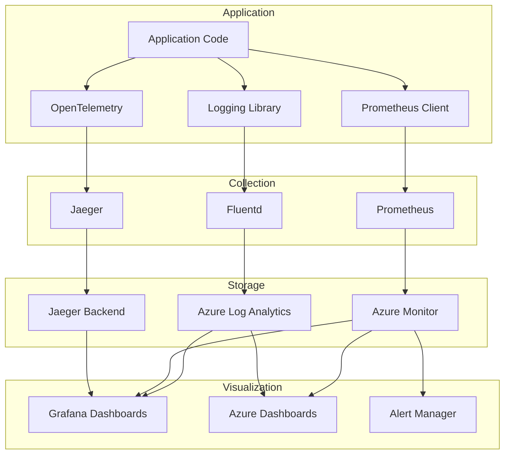

### Key Metrics Monitored

**Application Metrics:**
- Request rate, error rate, duration (RED method)
- Endpoint-specific latency percentiles (p50, p95, p99)
- Active user sessions
- Background job queue depth and processing time
- Cache hit/miss ratios

**Infrastructure Metrics:**
- CPU, memory, disk usage per pod
- Network I/O and bandwidth
- Database connection pool utilization
- Redis memory usage and eviction rate
- Storage IOPS and latency

**Business Metrics:**
- Active ADM systems count
- PIAs completed per day
- Fairness assessments with bias detected
- Individual requests by type and status
- Compliance check pass/fail rates

---

## Disaster Recovery

### Backup Strategy

**Database Backups:**
- Full backup: Daily at 02:00 AEST
- Differential backup: Every 6 hours
- Transaction log backup: Every 15 minutes
- Retention: 30 days standard, 7 years for audit logs
- Geographic replication to Australia Southeast

**Application Backups:**
- Infrastructure as Code (Terraform state): Daily backup to versioned storage
- Configuration: Stored in Git with encrypted secrets
- Blob storage: Geo-redundant with cross-region replication

### Recovery Objectives

| Scenario | RTO (Recovery Time Objective) | RPO (Recovery Point Objective) |
|----------|-------------------------------|-------------------------------|
| **Pod Failure** | < 1 minute | 0 (no data loss) |
| **Node Failure** | < 5 minutes | 0 (no data loss) |
| **AZ Failure** | < 15 minutes | < 5 minutes |
| **Region Failure** | < 4 hours | < 1 hour |
| **Database Corruption** | < 2 hours | < 15 minutes |
| **Complete System Loss** | < 8 hours | < 1 hour |

---

## Compliance & Data Sovereignty

### Australian Data Residency

**Data Storage Locations:**
- **Primary Region**: Azure Australia East (New South Wales)
- **Secondary Region**: Azure Australia Southeast (Victoria)
- **Prohibited Regions**: All non-Australian regions

**Data Flow Controls:**
- Network policies prevent data egress to non-AU regions
- Azure Policy enforces resource location constraints
- Terraform validation ensures AU-only deployments

### Audit Requirements

**Audit Log Capture:**
- All user authentication events
- All data access and modifications
- All administrative actions
- All API calls with parameters
- All failed authorization attempts

**Audit Log Properties:**
- Immutable (cannot be modified or deleted)
- Tamper-evident (checksums and timestamps)
- Retention: 7 years minimum
- Export capability for legal discovery

---

## Future Architecture Considerations

### Planned Enhancements

1. **Microservices Migration** - Gradual extraction of services (PIA, Fairness, etc.)
2. **Event-Driven Architecture** - Implement Event Bus (Azure Event Grid)
3. **GraphQL API** - Add GraphQL layer for flexible client queries
4. **Real-Time Dashboards** - WebSocket-based live metrics updates
5. **Mobile Applications** - Native iOS/Android apps
6. **AI-Assisted PIAs** - ML models to suggest risk assessments
7. **Blockchain Audit Trail** - Immutable audit log using distributed ledger
8. **Multi-Tenancy** - Support multiple organizations in single instance

---

## Appendices

### A. Technology Decisions

| Decision | Rationale |
|----------|-----------|
| **FastAPI over Django** | Async performance, modern Python, auto-documentation |
| **PostgreSQL over MongoDB** | ACID compliance, relational data, mature ecosystem |
| **React over Angular** | Component reusability, large ecosystem, team expertise |
| **AKS over VMs** | Container orchestration, auto-scaling, easier deployments |
| **Redis over Memcached** | Richer data structures, persistence, pub/sub support |

### B. Design Patterns Used

- **Repository Pattern** - Data access abstraction
- **Service Layer Pattern** - Business logic separation
- **Factory Pattern** - Object creation (Pydantic schemas)
- **Dependency Injection** - FastAPI dependencies
- **Observer Pattern** - Event notifications
- **Strategy Pattern** - Pluggable fairness metrics
- **Singleton Pattern** - Database connection pool

### C. References

- [FastAPI Documentation](https://fastapi.tiangolo.com/)
- [Azure Architecture Center](https://learn.microsoft.com/en-us/azure/architecture/)
- [Kubernetes Best Practices](https://kubernetes.io/docs/concepts/configuration/overview/)
- [OAIC Guidelines on Automated Decision-Making](https://www.oaic.gov.au/)
- [Australian Privacy Act 1988](https://www.legislation.gov.au/Series/C2004A03712)

---

**Document Control:**
- **Version**: 1.0.0
- **Last Updated**: 2024-01-XX
- **Author**: Architecture Team
- **Reviewers**: Security Team, Privacy Officer, CTO
- **Next Review**: Quarterly
